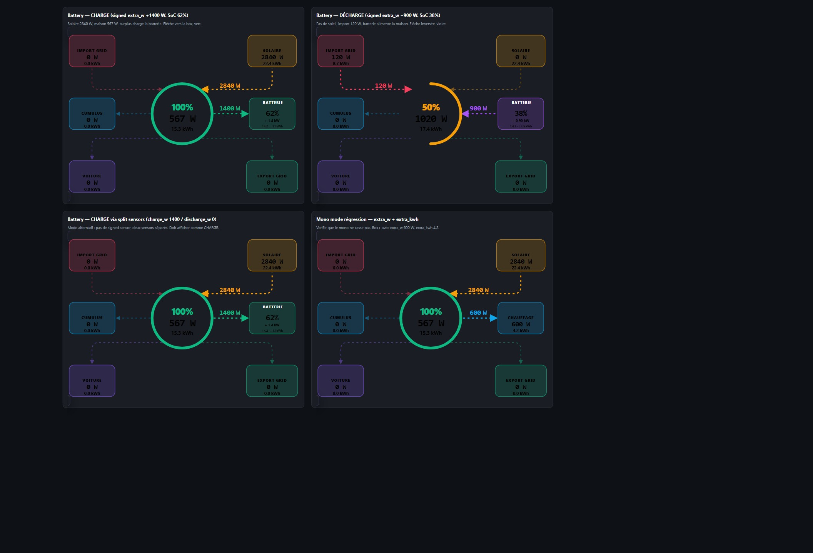

# Flux Énergie Card

A custom Lovelace card for Home Assistant that visualizes household energy flow as a hub-and-spoke diagram with an **autarky ring** at the center and animated arrows whose speed scales with power.



## Features

- **Hub-and-spoke layout**: a central Maison ring with up to 6 surrounding nodes — Solar, Grid Import, Grid Export, Cumulus (water heater / PV-router), EV charger, and an extra **Box+**
- **Every spoke is optional** — pick only the ones you have. A node disappears entirely (box, arrow, animations) as soon as you clear both its sensors
- **Autarky ring** around the Maison: animated, color-shifts green → amber → red as self-consumption drops
- **Animated flows**: arrow speed scales with power magnitude; idle flows are dimmed, not removed
- **Box+ has two modes**:
  - **Mono** — generic W + kWh box for any extra circuit (pool pump, heat pump, second EV…)
  - **Battery** — auto-detected charge/discharge direction (the arrow flips!), SoC %, daily ↑/↓ kWh. Accepts either a signed power sensor (`+` charge / `−` discharge) or two split sensors (`charge_w` / `discharge_w`)
- **Built-in visual editor** — no YAML required: pick sensors per node, customize colors, labels, icons and fonts, all from the dashboard
- **Click & long-press** on any node opens the relevant entity's more-info dialog
- Pure inline SVG — no external assets, no canvas, no `iframe`

## Installation

### HACS (custom repository) — recommended

1. In HACS → **Frontend** → ⋮ menu → **Custom repositories**
2. Add `https://github.com/akunia/ha-flux-energie` with category **Lovelace**
3. Install **Flux Énergie Card** from the list
4. Hard-refresh your browser (Ctrl + Shift + R)

The Lovelace resource is auto-registered by HACS.

### Manual

1. Copy `flux-energie-card.js` into `<config>/www/`
2. **Settings → Dashboards → ⋮ → Resources** → add `/local/flux-energie-card.js?v=0.8.0` as a *JavaScript module*
3. Hard-refresh your browser

## Configure with the visual editor

This is the recommended workflow — no YAML.

1. **Edit dashboard** → **+ Add card** → search for **Flux Énergie**
2. The editor lists each node (Maison, Solaire, Import grid, Export grid, Cumulus, Voiture, Box+). Click a node to expand it.
3. For each node you want, pick a **W** sensor and a **kWh** sensor. Sensor pickers are filtered by `unit_of_measurement` so you only see relevant entities.
4. **To hide a node, leave both its sensors empty.** It will disappear from the preview immediately. Maison is the only mandatory node.
5. For **Box+**, pick **Mode** at the top of its section: *Mono* (single W/kWh) or *Battery* (charge/discharge + SoC + daily ↑/↓ kWh).
6. Each non-Maison node also exposes **Label**, **Color**, and **Icon** overrides directly in the editor. The "Advanced options" section adds font sizes and an optional top label.

That's it.

## YAML reference

For users who prefer YAML or need an option not surfaced by the editor.

### Entity slots

All slots are optional except `house_consumption` / `house_daily_kwh`. A spoke is rendered if at least one of its two sensors is set.

| Node          | W sensor              | kWh sensor              |
| ------------- | --------------------- | ----------------------- |
| Maison (mandatory) | `house_consumption` | `house_daily_kwh`    |
| Solaire       | `pv_production`       | `pv_daily_kwh`          |
| Import grid   | `grid_import`         | `grid_daily_import`     |
| Export grid   | `grid_export`         | `grid_daily_export`     |
| Cumulus       | `pvrouter_surplus`    | `pvrouter_daily`        |
| Voiture       | `ev_charger_power`    | `ev_daily`              |
| Box+ (mono)   | `extra_w`             | `extra_kwh`             |
| Box+ (battery) | `extra_w` *(signed)* OR `extra_charge_w` + `extra_discharge_w` | `extra_charged_kwh` + `extra_discharged_kwh` (+ `extra_soc`) |

### Minimal example (Maison + Solaire only)

```yaml
type: custom:flux-energie-card
entities:
  house_consumption: sensor.house_w
  house_daily_kwh:   sensor.house_kwh
  pv_production:     sensor.pv_w
  pv_daily_kwh:      sensor.pv_kwh
```

### Box+ as a Mono box

```yaml
type: custom:flux-energie-card
entities:
  house_consumption: sensor.house_w
  house_daily_kwh:   sensor.house_kwh
  extra_w:   sensor.pool_pump_w
  extra_kwh: sensor.pool_pump_kwh
extra:
  type:  mono
  label: PISCINE
  icon:  mdi:pool
  color: "#0EA5E9"
```

### Box+ as a Battery box

```yaml
type: custom:flux-energie-card
entities:
  house_consumption: sensor.house_w
  house_daily_kwh:   sensor.house_kwh
  # Either a signed sensor:
  extra_w: sensor.battery_power_signed
  # Or two split sensors (preferred when your inverter exposes them separately):
  # extra_charge_w:    sensor.battery_charge_w
  # extra_discharge_w: sensor.battery_discharge_w
  extra_soc:            sensor.battery_soc
  extra_charged_kwh:    sensor.battery_charged_today
  extra_discharged_kwh: sensor.battery_discharged_today
extra:
  type:            battery
  charge_color:    "#10B981"   # emerald — default
  discharge_color: "#A855F7"   # violet — default
```

The card auto-picks split mode if either `extra_charge_w` or `extra_discharge_w` is non-zero, otherwise it falls back to the signed `extra_w`.

### Customization

All overrides are optional. Colors accept either an `r,g,b` string or a `#rrggbb` hex.

```yaml
colors:
  solaire: "#F59E0B"
  import:  "#F43F5E"
  export:  "#10B981"
  cumulus: "#0EA5E9"
  voiture: "#8B5CF6"
labels:
  solaire: PHOTOVOLTAÏQUE
  voiture: WALLBOX
icons:
  solaire: mdi:solar-power-variant
  maison:  mdi:home-modern
fonts:
  w_label_line: 25   # W labels on the arrows
  w_value:      26   # W value inside boxes
  kwh_value:    15   # kWh value inside boxes
top_label:
  text:      "Ma maison"
  font_size: 24
flow_style:
  active_opacity:        1.0
  inactive_opacity:      0.45
  active_stroke_width:   4
  inactive_stroke_width: 2.5
  inactive_color_mix:    100   # 0–100, blend toward card background when < 100
```

The Maison central display scales automatically — `fonts.*` only affect the surrounding boxes.

## Tips

- **Click** any box → opens the W entity's more-info dialog.
- **Long-press** (≥500 ms) any box → opens the kWh entity instead.
- **Battery split vs signed** — use split mode when your inverter exposes only positive `charge_w` / `discharge_w` (common with Solis, Huawei). Use signed mode when your inverter exposes a single `+/−` value (Sungrow, some Victron setups).
- **Noisy power sensors** — values display from 1 W upward. If you see arrow flicker around 0 ↔ 1 W, smooth it upstream with a template sensor that snaps anything below ~2 W to 0.

## License

MIT — see [LICENSE](LICENSE).
